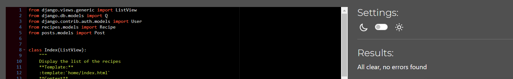
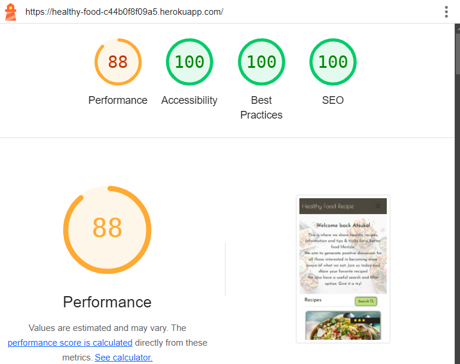
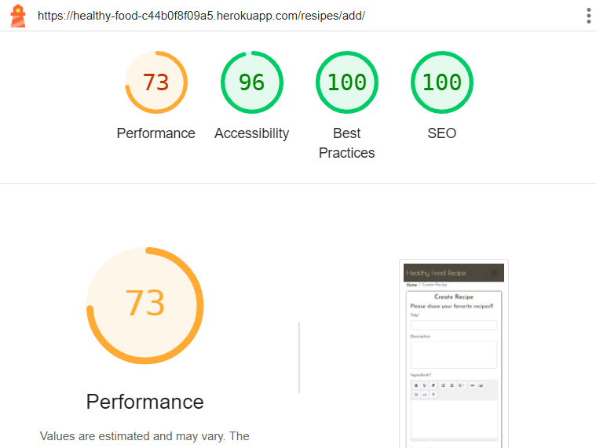
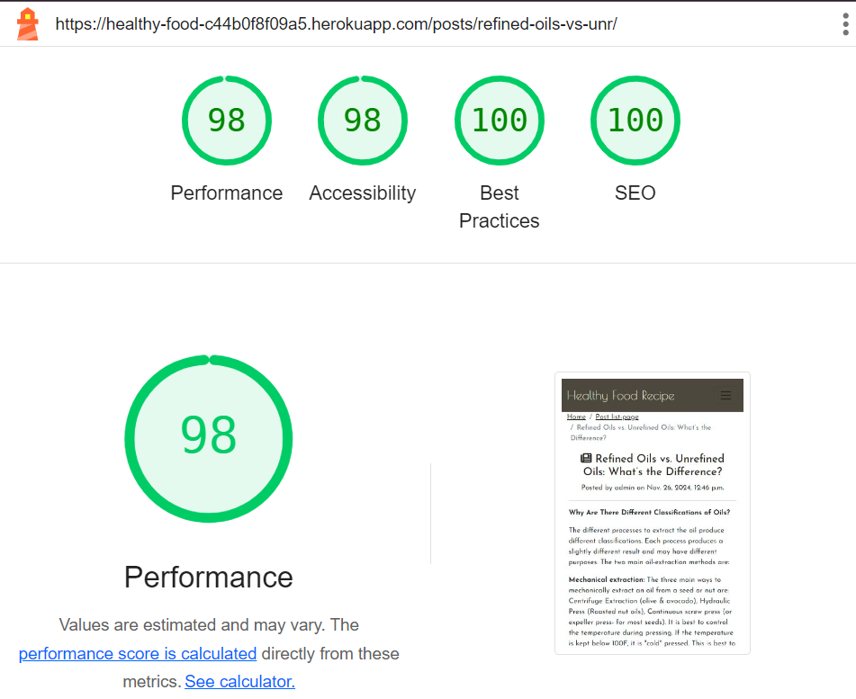
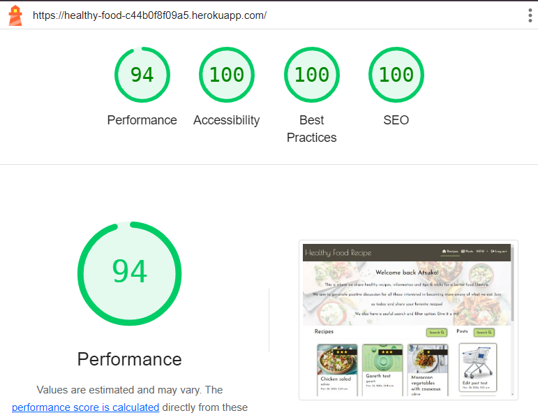
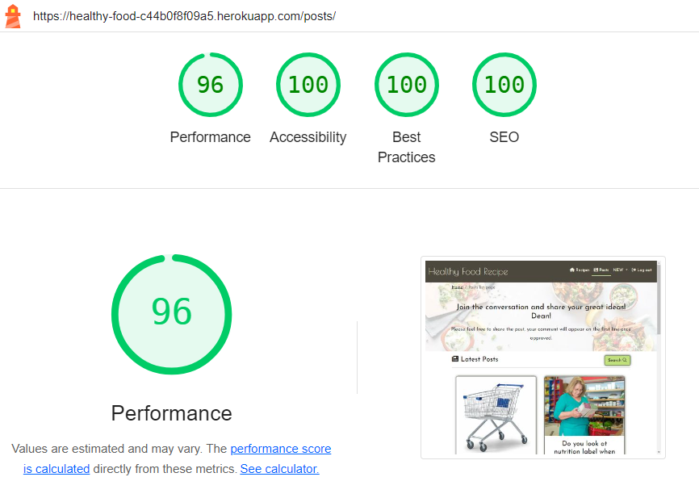
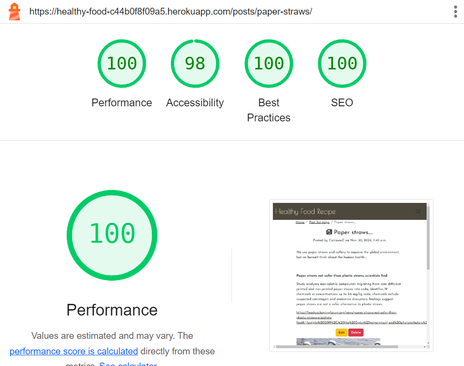

# Testing

## Code Validation

### HTML
| Page | W3C URL | Screenshot | Notes |
| --- | --- | --- | --- |
| Home | [W3C](https://validator.w3.org/nu/?doc=https%3A%2F%2Fhealthy-food-c44b0f8f09a5.herokuapp.com%2F) |  | Pass: No Errors |
| Sign-up | [W3C](https://validator.w3.org/nu/?doc=https%3A%2F%2Fhealthy-food-c44b0f8f09a5.herokuapp.com%2Faccounts%2Fsignup%2F) |  | Pass: No Errors |
| Log-in | [W3C](https://validator.w3.org/nu/?doc=https%3A%2F%2Fhealthy-food-c44b0f8f09a5.herokuapp.com%2Faccounts%2Flogin%2F) |  | Pass: No Errors |
| Log-out | [W3C](https://validator.w3.org/nu/?doc=https%3A%2F%2Fhealthy-food-c44b0f8f09a5.herokuapp.com%2Faccounts%2Flogout%2F) |  | Pass: No Errors |
| Recipe detail | [W3C](https://validator.w3.org/nu/?doc=https%3A%2F%2Fhealthy-food-c44b0f8f09a5.herokuapp.com%2Fresipes%2Fmussels-mariniere-with-cream-garlic-and-parsley%2F) |  | Depending on the article Summernote created, the score may drop to a lower point. These errors are beyond my control. |
| Recipe create | [W3C](https://validator.w3.org/nu/?doc=https%3A%2F%2Fhealthy-food-c44b0f8f09a5.herokuapp.com%2Fresipes%2Fadd%2F) |  | Depending on the article Summernote created, the score may drop to a lower point. These errors are beyond my control. |
| Recipe edit | [W3C](https://validator.w3.org/nu/?doc=https%3A%2F%2Fhealthy-food-c44b0f8f09a5.herokuapp.com%2Fresipes%2Fedit%2F47%2F) |  | Depending on the article Summernote created, the score may drop to a lower point. These errors are beyond my control. |
| Recipe delete | [W3C](https://healthy-food-c44b0f8f09a5.herokuapp.com/resipes/delete/47/) |  | Pass: No Errors |
| Posts | [W3C](https://validator.w3.org/nu/?doc=https%3A%2F%2Fhealthy-food-c44b0f8f09a5.herokuapp.com%2Fposts%2F) |  | Pass: No Errors |
| Post detail | [W3C](https://validator.w3.org/nu/?doc=https%3A%2F%2Fhealthy-food-c44b0f8f09a5.herokuapp.com%2Fposts%2Frefined-oils-vs-unr%2F) |  | Depending on the article Summernote created, the score may drop to a lower point. These errors are beyond my control. |
| Post create | [W3C](https://validator.w3.org/nu/?doc=https%3A%2F%2Fhealthy-food-c44b0f8f09a5.herokuapp.com%2Fposts%2Fadd%2F) |  | Depending on the article Summernote created, the score may drop to a lower point. These errors are beyond my control. |
| Post edit | [W3C](https://validator.w3.org/nu/?doc=https%3A%2F%2Fhealthy-food-c44b0f8f09a5.herokuapp.com%2Fposts%2Fedit%2Fedit-post-test%2F) |  | Depending on the article Summernote created, the score may drop to a lower point. These errors are beyond my control. |
| Post delete | [W3C](https://validator.w3.org/nu/?doc=https%3A%2F%2Fhealthy-food-c44b0f8f09a5.herokuapp.com%2Fposts%2Fdelete%2Fedit-post-test%2F) |  | Pass: No Errors |
| Custom Error 400 | [W3C](https://validator.w3.org) |  | Pass: No Errors |
| Custom Error 403 | [W3C](https://validator.w3.org) |  | Pass: No Errors |
| Custom Error 404 | [W3C](https://validator.w3.org) |  | Pass: No Errors |
| Custom Error 500 | [W3C](https://validator.w3.org) |  | Pass: No Errors |

### CSS
| File | Jigsaw URL | Screenshot | Notes |
| --- | --- | --- | --- |
| style.css | [Jigsaw](https://jigsaw.w3.org/css-validator/validator?uri=https%3A%2F%2Fhealthy-food-c44b0f8f09a5.herokuapp.com%2F&profile=css3svg&usermedium=all&warning=1&vextwarning=&lang=en) |  | Pass: No Errors |

### JavaScript
| File | Screenshot | Notes |
| --- | --- | --- |
| recipe-comment.js |  | Pass: No Errors |

### Python

I have used the recommended [PEP8 CI Python Linter](https://pep8ci.herokuapp.com) to validate all of my Python files.

#### Validation For my_project Project
| File | CI URL | Screenshot | Notes |
| --- | --- | --- | --- |
| asgi.py | [PEP8 CI](https://pep8ci.herokuapp.com/) |  | Pass: No Errors |
| settings.py | [PEP8 CI](https://pep8ci.herokuapp.com/) |  | Pass: No Errors |
| urls.py | [PEP8 CI](https://pep8ci.herokuapp.com/) |  | Pass: No Errors |
| wsgi.py | [PEP8 CI](https://pep8ci.herokuapp.com/) |  | Pass: No Errors |

#### Validation For home App
| File | CI URL | Screenshot | Notes |
| --- | --- | --- | --- |
| apps.py | [PEP8 CI](https://pep8ci.herokuapp.com/) |  | Pass: No Errors |
| urls.py | [PEP8 CI](https://pep8ci.herokuapp.com/) |  | Pass: No Errors |
| views.py | [PEP8 CI](https://pep8ci.herokuapp.com/) |  | Pass: No Errors |

#### Validation For recipes App
| File | CI URL | Screenshot | Notes |
| --- | --- | --- | --- |
| admin.py | [PEP8 CI](https://pep8ci.herokuapp.com/) |  | Pass: No Errors |
| apps.py | [PEP8 CI](https://pep8ci.herokuapp.com/) |  | Pass: No Errors |
| forms.py | [PEP8 CI](https://pep8ci.herokuapp.com/) |  | Pass: No Errors |
| models.py | [PEP8 CI](https://pep8ci.herokuapp.com/) |  | Pass: No Errors |
| urls.py | [PEP8 CI](https://pep8ci.herokuapp.com/) |  | Pass: No Errors |
| views.py | [PEP8 CI](https://pep8ci.herokuapp.com/) |  | Pass: No Errors |

#### Validation For posts App
| File | CI URL | Screenshot | Notes |
| --- | --- | --- | --- |
| admin.py | [PEP8 CI](https://pep8ci.herokuapp.com/) |  | Pass: No Errors |
| apps.py | [PEP8 CI](https://pep8ci.herokuapp.com/) |  | Pass: No Errors |
| forms.py | [PEP8 CI](https://pep8ci.herokuapp.com/) |  | Pass: No Errors |
| models.py | [PEP8 CI](https://pep8ci.herokuapp.com/) |  | Pass: No Errors |
| urls.py | [PEP8 CI](https://pep8ci.herokuapp.com/) |  | Pass: No Errors |
| views.py | [PEP8 CI](https://pep8ci.herokuapp.com/) |  | Pass: No Errors |

## Browser Compatibility

I've tested my deployed project on multiple browsers.

| Browser | Screenshot | Notes |
| --- | --- | --- |
| Chrome |  | Pass: No Errors |
| Firefox |  | Pass: No Errors |
| Edge |  | Pass: No Errors |
| Safari |  | Pass: No Errors |
| Opera |  | Pass: No Errors |

## Responsiveness

I've tested my deployed project on multiple devices.

| Device | Screenshot | Notes |
| --- | --- | --- |
| Mobile |  |  |
| Tablet (DevTools) |  |  |
| Laptop 16" |  | ted |
| Desktop 21.5" |  |  |
| 4K Monitor 40" |  |  |

## Lighthouse Audit

I've tested my deployed project using the Lighthouse Audit tool.

### Mobile Testing
| Page | Size | Screenshot | Notes |
| --- | --- | --- | --- |
| Home | Mobile |  | Some minor performance warnings |
| Recipe create | Mobile |  | Accessibility points were deducted by this error `<frame> or <iframe> elements do not have a title` This caused by summernote and outof my controll |
| Recipe detail | Mobile |  | The image resize module's setting is 400px, but depending on user's image, this may not be of sufficient quality |
| Recipe edit | Mobile |  | Accessibility points were deducted by this error `<frame> or <iframe> elements do not have a title` This caused by summernote and outof my controll |
| Recipe delete | Mobile |  | Some minor performance warnings |
| Posts | Mobile |  | Some minor performance warnings |
| Posts create | Mobile |  | Accessibility points were deducted by this error `<frame> or <iframe> elements do not have a title` This caused by summernote and outof my controll |
| Posts detail | Mobile |  | Accessibility points were deducted to keep the same formatting as the recipe page, I've skipped the heading's order "h3" |
| Posts edit | Mobile |  | Accessibility points were deducted to keep the same formatting as the recipe page, I've skipped the heading's order "h3" |
| Posts delete | Mobile |  | Some minor performance warnings |
| Custom Error 404 | Mobile |  | Some minor performance warnings |
| Custom Error 500 | Mobile |  | Some minor performance warnings |

### Desktop Testing
| Page | Size | Screenshot | Notes |
| --- | --- | --- | --- |
| Home | Desktop |  | Some minor performance warnings |
| Recipe create | Desktop |  | Accessibility points were deducted by this error `<frame> or <iframe> elements do not have a title` This caused by summernote and outof my controll |
| Recipe detail | Desktop |  | Some minor performance warnings |
| Recipe edit | Desktop |  | Accessibility points were deducted by this error `<frame> or <iframe> elements do not have a title` This caused by summernote and outof my controll |
| Recipe delete | Desktop |  | Some minor performance warnings |
| Posts | Desktop |  | Some minor performance warnings |
| Posts create | Desktop |  | Accessibility points were deducted by this error `<frame> or <iframe> elements do not have a title` This caused by summernote and outof my controll |
| Posts detail | Desktop |  | Accessibility points were deducted to keep the same formatting as the recipe page, I've skipped the heading's order "h3" |
| Posts edit | Desktop |  | Accessibility points were deducted to keep the same formatting as the recipe page, I've skipped the heading's order "h3" |
| Posts delete | Desktop |  | Some minor performance warnings |
| Custom Error 400 | Desktop |  | Some minor performance warnings |
| Custom Error 403 | Desktop |  | Some minor performance warnings |
| Custom Error 404 | Desktop |  | Some minor performance warnings |
| Custom Error 500 | Desktop |  | Some minor performance warnings |

## Defensive Programming

Defensive programming was manually tested with the below user acceptance testing:

| Home Page | User Action | Expected Result | Pass/Fail | Comments |
| --- | --- | --- | --- | --- |
| Nav links | Click on Logo | Redirection to Home page | Pass | |
| | Click on Home Recipes link in navbar | Redirection to Home page | Pass | |
| | Click on Posts link in navbar | Redirection to Posts page | Pass | |
| | Hover on New link in navbar  | Display dropdown list | Pass | |
| Authenticated user only | Click on Create Recipe - in dropdown list | Redirection to Create Recipe page | Pass | |
| Authenticated user only | Click on Create Post - in dropdown list | Redirection to Create Post page | Pass | |
| Not authenticated user only | Click on Create Recipe - in dropdown list | Redirection to Log-in page | Pass | |
| Not authenticated user only | Click on Create Post - in dropdown list | Redirection to Log-in page | Pass | |
| Not authenticated user only | Click on Sign-up link in navbar | Redirection to Sign-up page | Pass | |
| Not authenticated user only | Click on Log-in link in navbar | Redirection to Log-in page | Pass | |
| Authenticated user only | Click on Logout link in navbar | Redirection to Logout page | Pass | |  

| Home Page | User Action | Expected Result | Pass/Fail | Comments |
| --- | --- | --- | --- | --- |
| Home contents | Click on Recipes' Search button | Open Search option modal | Pass | |
| | Click on Posts' Search button | Open Search option modal | Pass | |
| | Click on one of the listed recipes | Redirection to the recipes' detail page | Pass | |
| | Click on one of the listed posts | Redirection to the posts' detail page | Pass | |
| | Hover all the link objects | Response changeing colour except star rating | Pass | |
| | Click on pagination links (default) | Redirection to next/previous page order by descending dates | Pass | |
| | Click on pagination links (search results) | Redirection to next/previous page of results | Pass | |

| Home Page | User Action | Expected Result | Pass/Fail | Comments |
| --- | --- | --- | --- | --- |
| Recipes search modal | Quick search - Low-Sugar | Sort the recipe's list only Low-Sugar | Pass | |
| | Quick search - Gluten-Free | Filter - sort the recipe's list only Gluten-Free | Pass | |
| | Quick search - Dairy-Free | Filter - sort the recipe's list only Dairy-Free | Pass | |
| | Quick search - Vegan | Filter - sort the recipe's list only Vegan | Pass | |
| | Quick search - Vegitarian | Filter - sort the recipe's list only Vegitarian | Pass | |
| | Quick search - High-Fiber | Filter - sort the recipe's list only High-Fiber | Pass | |
| | Quick search - High-Protein | Filter - sort the recipe's list only High-Protein | Pass | |
| | Quick search - Nut-Free | Filter - sort the recipe's list only Nut-Free | Pass | |
| | Quick search - Few options selected | Filter - sort the recipe's list that reflects the selected options | Pass | |
| | Quick search - Not selected any box | Redirection to the recipes' list page order by descending dates | Pass | |
| | Ingredients search - Avoid ingredients Input something (e.g. egg) | Sort the recipe's list except the input ingredients value | Pass | |
| | Ingredients search - Include ingredients Input something (e.g. egg) | Sort the recipe's list inclued the input ingredients value | Pass | |
| | Ingredients search - Avoid & Include ingredients input both fields | Sort the recipe's list that reflects both except and include | Pass | |
| | Ingredients search - Imput nothing | Redirection to the recipes' list page order by descending dates | Pass | |
| | Free search - Input something (e.g. egg) | Sort the recipe's list that the word in the title, description or instruction field | Pass | |
| | Free search - Imput nothing | Redirection to the recipes' list page order by descending dates | Pass | |
| | Recipes' Owner search - Select the owner | Sort the recipe's list that belongs to the owner | Pass | |
| | Recipes' Owner search - Not select anyone | Redirection to the recipes' list page order by descending dates | Pass | |
| | Click on Right top corner "X" button | Close the search modal | Pass | |
| | Click on Right bottom corner "close" button | Close the search modal | Pass | |

| Home and Posts Page | User Action | Expected Result | Pass/Fail | Comments |
| --- | --- | --- | --- | --- |
| Posts search modal | Words search - Avoid word (e.g. egg) | Sort the posts' list except the value | Pass | |
| | Words search - Include word (e.g. egg) | Sort the posts' list inclued the value | Pass | |
| | Words search - Avoid & Include ingredients input both fields | Sort the posts' list that reflects both except and include | Pass | |
| | Words search - Imput nothing | Redirection to the posts' list page order by descending dates | Pass | |
| | Posts' Owner search - Select the owner | Sort the posts' list that belongs to the owner | Pass | |
| | Posts' Owner search - Not select anyone | Redirection to the posts' list page order by descending dates | Pass | |
| | Click on Right top corner "X" button | Close the search modal | Pass | |
| | Click on Right bottom corner "close" button | Close the search modal | Pass | |

| All page's footer | User Action | Expected Result | Pass/Fail | Comments |
| --- | --- | --- | --- | --- |
| | Click on facebook icon | Redirection to facebook website in new tab/window | Pass | |
| | Click on X/Twitter icon | Redirection to X/Twitter website in new tab/window | Pass | |
| | Click on Youtube icon | Redirection to Youtube website in new tab/window | Pass | |
| | Click on instagram icon | Redirection to instagram website in new tab/window | Pass | |

| Sign-up Page | User Action | Expected Result | Pass/Fail | Comments |
| --- | --- | --- | --- | --- |
| Sign-up | Username - empty value | Field will not accept an empty value | Pass | |
| | Enter invalid email address | Field will only accept email address format | Pass | |
| | Enter invalid password (twice) | Field will only accept password with AllAuth validated format | Pass | |
| | Click on Sign-up button (All required fields have been validated) | Redirects to Home page with success message | Pass |
| | Click on Sign-up button (All required fields haven't been validated) | A warning message appears | Pass |

| Log-in Page | User Action | Expected Result | Pass/Fail | Comments |
| --- | --- | --- | --- | --- |
| Log-in | Enter invalid Username | Field will only accept registered username | Pass | |
| | Enter invalid password | Field will only accept correct password | Pass | |
| | Click Log-in button  (All required fields have been validated) | Redirects to home page with success message | Pass | |
| | Click Log-in button  (All required fields haven't been validated) | A pop up warning message appears | Pass | |

| Log-out Page | User Action | Expected Result | Pass/Fail | Comments |
| --- | --- | --- | --- | --- |
| Log-out | Click Logout button | Logs out user, redirects to Home page with success message | Pass |

| Recipe detail's Page | User Action | Expected Result | Pass/Fail | Comments |
| --- | --- | --- | --- | --- |
| Authenticated and owner only | Click on Delete recipe button | Redirection to deletion confirmation page | Pass | |
| Authenticated and owner only | Click on Edit recipe button | Redirection to Edit page | Pass | |
| Authenticated and NOT owner | Star rating - Click on the star(5) | Switching on the yellow color(5stars) | Pass | |
| Authenticated and NOT owner | Star rating - Click on the Submit button | Reload the page and reflect the average score and show personal score | Pass | |
| Not authenticated user | Click on the Log-in or Sign-up button | Redirection to the Log-in or Sign-up page | Pass | |
| Authenticated user only | Comment input - Click on the Submit button with empty field | Empty field will not accept | Pass | |
| Authenticated user only | Comment input - Click on the Submit button with some comment | The comment is displayed at Comments list | Pass | |
| Authenticated and owner only | Comment list - Click on the Delete button | Deletion comfirmation modal will dispaly | Pass | |
| Authenticated and owner only | Comment list - Click on the Delete button on the Delete modal | The comment is deleted and success message | Pass | |
| Authenticated and owner only | Comment list - Click on Right top corner "X" button on the Delete modal | Close the search modal | Pass | |
| Authenticated and owner only | Comment list - Click on Right bottom corner "close" button on the Delete modal | Close the search modal | Pass | |
| Authenticated and owner only | Comment list - Click on the Edit button | The comment is displayed in a comment field with Update button | Pass | |
| Authenticated and owner only | Comment list - Click on the Update button | The comment is updated and success message | Pass | |

* Authenticated user only
| Create Recipe Page | User Action | Expected Result | Pass/Fail | Comments |
| --- | --- | --- | --- | --- |
| | Title - empty value | Field will not accept empty value | Pass | |
| | Ingredients - empty value | Field will not accept empty value | Pass | |
| | Instructions - empty value | Field will not accept empty value | Pass | |
| | Image - No file is selected | Default image is selected for substitution | Pass | |
| | Click on Save button (Required fields are filled) | The recipe is saved and redirect to detail page | Pass | |
| | Click on Save button (Required fields aren't filled) | Not filled required field is active | Pass | |

* Authenticated user only
| Edit Recipe Page | User Action | Expected Result | Pass/Fail | Comments |
| --- | --- | --- | --- | --- |
| | Title - empty value | Field will not accept empty value | Pass | |
| | Ingredients - empty value | Field will not accept empty value | Pass | |
| | Instructions - empty value | Field will not accept empty value | Pass | |
| | Click on Save button (Required fields are filled) | The recipe is saved and redirect to detail page | Pass | |
| | Click on Save button (Required fields aren't filled) | Not filled required field is active | Pass | |

* Authenticated user only
| Delete Recipe Page | User Action | Expected Result | Pass/Fail | Comments |
| --- | --- | --- | --- | --- |
| | Click on Confirm Delete button | Delete the recipe and redirection to the Home page | Pass | |
| | Click on go back button | Redirection to the Recipe detail page | Pass | |

| Posts Page | User Action | Expected Result | Pass/Fail | Comments |
| --- | --- | --- | --- | --- |
| Posts contents | Click on Posts' Search button | Open Search option modal | Pass | |
| | Click on one of the listed posts | Redirection to the recipes' detail page | Pass | |
| | Hover all the link objects | Response changeing colour except star rating | Pass | |
| | Click on pagination links (default) | Redirection to next/previous page order by descending dates | Pass | |
| | Click on pagination links (search results) | Redirection to next/previous page of results | Pass | |
| Authenticated and owner only | Click on one of the unauthorised recipes | Redirection to the recipes' detail page | Pass | |

## User Story Testing

| User Story | Screenshot |
| --- | --- |

## Automated Testing

### Python (Unit Testing)

