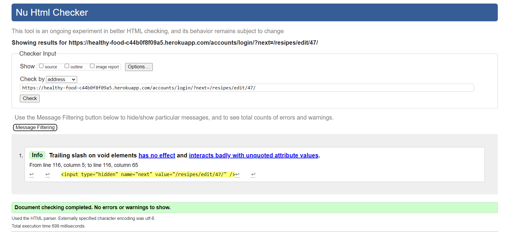

# Testing

## Code Validation

### HTML
| Page | W3C URL | Screenshot | Notes |
| --- | --- | --- | --- |
| Home | [W3C](https://validator.w3.org/nu/?doc=https%3A%2F%2Fhealthy-food-c44b0f8f09a5.herokuapp.com%2F) |  | Pass: No Errors |
| Sign-up | [W3C](https://validator.w3.org) |  | Pass: No Errors |
| Log-in | [W3C](https://validator.w3.org) |  | Pass: No Errors |
| Log-out | [W3C](https://validator.w3.org) |  | Pass: No Errors |
| Recipe detail | [W3C](https://validator.w3.org) |  | Pass: No Errors　The warning does not apply |
| Recipe create | [W3C](https://validator.w3.org) |  | These errors are caused by the summernote and are beyond my control. |
| Recipe edit | [W3C](https://validator.w3.org) |  | These errors are caused by the summernote and are beyond my control. |
| Recipe delete | [W3C](https://validator.w3.org) |  | Pass: No Errors |
| Posts | [W3C](https://validator.w3.org) |  | Pass: No Errors |
| Post detail | [W3C](https://validator.w3.org) |  | Pass: No Errors |
| Post create | [W3C](https://validator.w3.org) |  | Pass: No Errors |
| Post edit | [W3C](https://validator.w3.org) |  | These errors are caused by the summernote and are beyond my control. |
| Post delete | [W3C](https://validator.w3.org) |  | Pass: No Errors |
| Custom Error 400 | [W3C](https://validator.w3.org) |  | Pass: No Errors |
| Custom Error 403 | [W3C](https://validator.w3.org) |  | Pass: No Errors |
| Custom Error 404 | [W3C](https://validator.w3.org) |  | Pass: No Errors |
| Custom Error 500 | [W3C](https://validator.w3.org) |  | Pass: No Errors |

### CSS
| File | Jigsaw URL | Screenshot | Notes |
| --- | --- | --- | --- |
| style.css | [Jigsaw](https://jigsaw.w3.org/css-validator/) |  | Pass: No Errors |

### JavaScript
| File | Screenshot | Notes |
| --- | --- | --- |
| recipe-comment.js |  | Pass: No Errors |

### Python

I have used the recommended [PEP8 CI Python Linter](https://pep8ci.herokuapp.com) to validate all of my Python files.

#### Validation For my_project App
| File | CI URL | Screenshot | Notes |
| --- | --- | --- | --- |
| asgi.py | [PEP8 CI]() |  | Pass: No Errors |
| settings.py | [PEP8 CI]() |  | Pass: No Errors |
| urls.py | [PEP8 CI]() |  | Pass: No Errors |
| wsgi.py | [PEP8 CI]() |  | Pass: No Errors |

#### Validation For Home App
| File | CI URL | Screenshot | Notes |
| --- | --- | --- | --- |
| apps.py | [PEP8 CI]() |  | Pass: No Errors |
| tests.py | [PEP8 CI]() |  | Pass: No Errors |
| urls.py | [PEP8 CI]() |  | Pass: No Errors |
| views.py | [PEP8 CI]() |  | Pass: No Errors |

#### Validation For recipes App
| File | CI URL | Screenshot | Notes |
| --- | --- | --- | --- |
| admin.py | [PEP8 CI]() |  | Pass: No Errors |
| apps.py | [PEP8 CI]() |  | Pass: No Errors |
| forms.py | [PEP8 CI]() |  | Pass: No Errors |
| models.py | [PEP8 CI]() |  | Pass: No Errors |
| tests.py | [PEP8 CI]() |  | Pass: No Errors |
| urls.py | [PEP8 CI]() |  | Pass: No Errors |
| views.py | [PEP8 CI]() |  | Pass: No Errors |

## Browser Compatibility

I've tested my deployed project on multiple browsers.

| Browser | Screenshot | Notes |
| --- | --- | --- |
| Chrome |  | Pass: No Errors |
| Firefox |  | Pass: No Errors |
| Edge |  | Pass: No Errors |
| Safari |  | Pass: No Errors |
| Brave |  | Pass: No Errors |
| Opera |  | Pass: No Errors |
| Internet Explorer | | |

## Responsiveness

I've tested my deployed project on multiple devices.

| Device | Screenshot | Notes |
| --- | --- | --- |
| Mobile (DevTools) |  |  |
| Tablet (DevTools) |  |  |
| Desktop |  | ted |
| XL Monitor |  |  |
| 4K Monitor |  |  |

## Lighthouse Audit

I've tested my deployed project using the Lighthouse Audit tool.

### Website App Templates - Mobile Testing
| Page | Size | Screenshot | Notes |
| --- | --- | --- | --- |
| Home | Mobile |  | Some minor performance warnings |
| Recipe create | Mobile |  | Accessibility points were deducted by this error `<frame> or <iframe> elements do not have a title` This caused by summernote and outof my controll |
| Recipe detail | Mobile |  | Some minor performance warnings |
| Recipe edit | Mobile |  | Some minor performance warnings |
| Recipe delete | Mobile |  | Some minor performance warnings |
| Posts | Mobile |  | Some minor performance warnings |
| Posts detail | Mobile |  | Some minor performance warnings |
| Custom Error 400 | Mobile |  | Some minor performance warnings |
| Custom Error 403 | Mobile |  | Some minor performance warnings |
| Custom Error 404 | Mobile |  | Some minor performance warnings |
| Custom Error 500 | Mobile |  | Some minor performance warnings |

### Website App Templates - Desktop Testing
| Page | Size | Screenshot | Notes |
| --- | --- | --- | --- |
| Home | Desktop |  | Some minor performance warnings |
| Recipe detail | Desktop |  | Some minor performance warnings |
| Recipe create | Desktop |  | Some minor performance warnings |
| Recipe edit | Desktop |  | Some minor performance warnings |
| Recipe delete | Desktop |  | Some minor performance warnings |
| Posts | Desktop |  | Some minor performance warnings |
| Posts detail | Desktop |  | Some minor performance warnings |
| Custom Error 400 | Desktop |  | Some minor performance warnings |
| Custom Error 403 | Desktop |  | Some minor performance warnings |
| Custom Error 404 | Desktop |  | Some minor performance warnings |
| Custom Error 500 | Desktop |  | Some minor performance warnings |

### Users App Templates - Mobile Testing
| Page | Size | Screenshot | Notes |
| --- | --- | --- | --- |
| Login | Mobile |  | Some minor performance warnings |
| Logout | Mobile |  | Some minor performance warnings |
| Register | Mobile |  | Some minor performance warnings |
| Profile | Mobile |  | Some minor performance warnings |
| Password reset | Mobile |  | Some minor performance warnings |
| Password reset-done | Mobile |  | Some minor performance warnings |
| Password reset-confirm | Mobile |  | Some minor performance warnings |
| Password reset-complete | Mobile |  | Some minor performance warnings |

### Users App Templates - Desktop Testing
| Page | Size | Screenshot | Notes |
| --- | --- | --- | --- |
| Login | Desktop |  | Some minor performance warnings |
| Logout | Desktop |  | Some minor performance warnings |
| Register | Desktop |  | Some minor performance warnings |
| Profile | Desktop |  | Some minor performance warnings |
| Password reset | Desktop |  | Some minor performance warnings |
| Password reset-done | Desktop |  | Some minor performance warnings |
| Password reset-confirm | Desktop |  | Some minor performance warnings |
| Password reset-complete | Desktop |  | Some minor performance warnings |

## Defensive Programming

Defensive programming was manually tested with the below user acceptance testing:

| Page | User Action | Expected Result | Pass/Fail | Comments |
| --- | --- | --- | --- | --- |
| Nav links | Click on Logo | Redirection to Home page | Pass | |
| | Click on Home link in navbar | Redirection to Home page | Pass | |
| | Hover on New link in navbar  | Display dropdown list | Pass | |
| | Click on Create Recipe - in dropdown list | Redirection to Create Recipe page | Pass | |
| | Click on Create Post - in dropdown list | Redirection to Create Post page | Pass | |
| | Click on Sign-up link in navbar | Redirection to Sign-up page | Pass | |
| | Click on Log-in link in navbar | Redirection to Log-in page | Pass | |
| | Click on Logout link in navbar | Redirection to Logout page | Pass | |  

| Page | User Action | Expected Result | Pass/Fail | Comments |
| --- | --- | --- | --- | --- |
| Home contents | Click on Search button | Open Search option modal | Pass | |
| | Click on one of the listed recipe | Redirection to the recipe's detail page | Pass | |
| | Hover all the link objects | Response changeing colour | Pass | |
| | Click on pagination links | to that pagination page | Pass | |
| | When the list was sorted by search - Click on pagination links | Redirection to that sorted list's pagination page | Pass | |

| Page | User Action | Expected Result | Pass/Fail | Comments |
| --- | --- | --- | --- | --- |
| Option search modal | Quick search - Low-Sugar | Sort the recipe's list only Low-Sugar | Pass | |
| | Quick search - Gluten-Free | Filter - sort the recipe's list only Gluten-Free | Pass | |
| | Quick search - Dairy-Free | Filter - sort the recipe's list only Dairy-Free | Pass | |
| | Quick search - Vegan | Filter - sort the recipe's list only Vegan | Pass | |
| | Quick search - Vegitarian | Filter - sort the recipe's list only Vegitarian | Pass | |
| | Quick search - High-Fiber | Filter - sort the recipe's list only High-Fiber | Pass | |
| | Quick search - High-Protein | Filter - sort the recipe's list only High-Protein | Pass | |
| | Quick search - Nut-Free | Filter - sort the recipe's list only Nut-Free | Pass | |
| | Quick search - few options selected | Filter - sort the recipe's list that reflects the selected options | Pass | |
| | Ingredients search - Avoid ingredients Input something (e.g. egg) | Sort the recipe's list except the input ingredients value | Pass | |
| | Ingredients search - Include ingredients Input something (e.g. egg) | Sort the recipe's list inclued the input ingredients value | Pass | |
| | Ingredients search - Avoid & Include ingredients input both fields | Sort the recipe's list that reflects both except and include | Pass | |
| | Free search - Input something (e.g. egg) | Sort the recipe's list that the word in the title, description or instruction field | Pass | |
| | Recipe's Owner search - select the owner | Sort the recipe's list that belongs to the owner | Pass | |
| | Click on Right top corner "X" button | Close the search modal | Pass | |
| | Click on Right bottom corner "close" button | Close the search modal | Pass | |

| Page | User Action | Expected Result | Pass/Fail | Comments |
| --- | --- | --- | --- | --- |
| Footer links | Click on Healthy Food Club link | Redirection to Healthy Food Club website in new tab/window | Pass | |
| | Click on facebook icon | Redirection to facebook website in new tab/window | Pass | |
| | Click on X/Twitter icon | Redirection to X/Twitter website in new tab/window | Pass | |
| | Click on Youtube icon | Redirection to Youtube website in new tab/window | Pass | |
| | Click on instagram icon | Redirection to instagram website in new tab/window | Pass | |

| Page | User Action | Expected Result | Pass/Fail | Comments |
| --- | --- | --- | --- | --- |
| Sign-up | Username - empty value | Field will not accept empty value | Pass | |
| | Enter invalid email address | Field will only accept email address format | Pass | |
| | Enter invalid password (twice) | Field will only accept password format | Pass | |
| | Click on Sign-up button | Redirects to Home page with success message | Pass |
| Log-in | Enter invalid Username | Field will only accept registered username | Pass | |
| | Enter invalid password | Field will only accept correct password | Pass | |
| | Click Log-in button | Redirects to home page with success message | Pass | |
| Log-out | Click Logout button | Logs out user, redirects to Home page with success message | Pass |

| Page | User Action | Expected Result | Pass/Fail | Comments |
| --- | --- | --- | --- | --- |
| Recipe detaild page | Click on Delete recipe button | Redirect to deletion confirmation page | Pass | |
| | Click on Edit recipe button | Redirect to Edit page | Pass | |
| | Star rating - Click on the star(5) | Switching on the yellow color(5stars) | Pass | |
| | Star rating - Click on the Submit button | Reload the page and reflect the average score and show personal score | Pass | |
| | Comment input - Click on the Submit button with empty field | Empty field will not accept | Pass | |
| | Comment input - Click on the Submit button with some comment | The comment is displayed at Comments list | Pass | |
| | Comment list - Click on the Delete button | Deletion comfirmation modal will dispaly | Pass | |
| | Comment list - Click on the Delete button on the Delete modal | The comment is deleted and success message | Pass | |
| | Comment list - Click on Right top corner "X" button on the Delete modal | Close the search modal | Pass | |
| | Comment list - Click on Right bottom corner "close" button on the Delete modal | Close the search modal | Pass | |
| | Comment list - Click on the Edit button | The comment is filled in Leave a comment section with Update button | Pass | |
| | Comment list - Click on the Update button | The comment is updated and success message | Pass | |
| | Not authenticated user cannot visit the pages that need user's authentication | Redirects to sign-up page | Pass |
| | Authenticated users cannot visit other user's edit page | Redirects to 403 forbidden page | Pass |
| | Authenticated users cannot visit other user's Delete page | Redirects to 403 forbidden page | Pass |

| Page | User Action | Expected Result | Pass/Fail | Comments |
| --- | --- | --- | --- | --- |
| Add Recipe | Title - empty value | Field will not accept empty value | Pass | |
| | Ingredients - empty value | Field will not accept empty value | Pass | |
| | Instructions - empty value | Field will not accept empty value | Pass | |
| | Image - No file is selected | Default image is selected for substitution | Pass | |
| | Click on Save button | The recipe is saved and redirect to detail page | Pass | |

## User Story Testing

| User Story | Screenshot |
| --- | --- |

## Automated Testing

### Python (Unit Testing)

