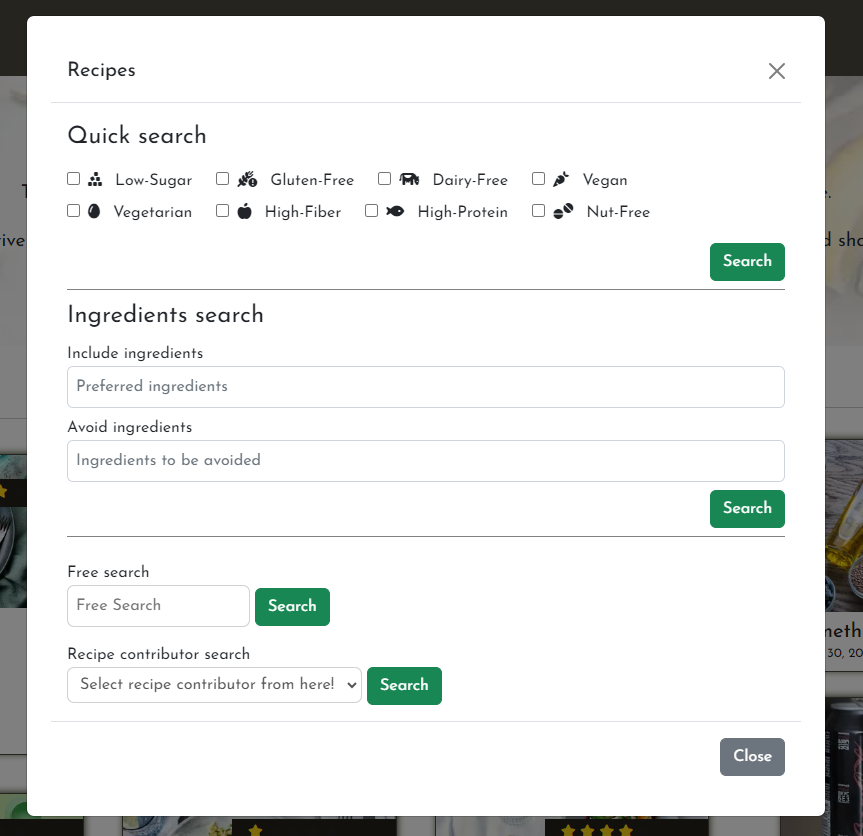

# Healthy Food Recipe
This website aims to raise awareness of health and wellness by sharing recipes with an emphasis on good and safe ingredients.   
  
The target users are people looking for healthier living and recipes, especially those with health issues such as diabetes or allergies.  
One notable feature in this website is the various search options for recipe categories for the target peoples.  
And if the user create a new recipe that uses safe ingredients, sharing it is a great option for others to use too.  
  
We also provide a health article posting and sharing feature to encourage active communication, information sharing, and sometimes discussion in community groups.  
I hope that these activities will inspire all of us to make better food and lifestyle choices.
 


  
**[Heroku deployed site - Healthy Food Recipe](https://healthy-food-c44b0f8f09a5.herokuapp.com/ "Heroku deployed site - Healthy Food Recipe")**  

## 1. Strategy Plane
### Target users 
1.	Everyone who cares about food additives, health and simply enjoys cooking.
2.	Specially who already has some health issues, to give them easy search options.
3.  Young people who are about to start living independently, as well as their parents.
### User value 
1.	Users can find a community which promotes everyone’s health through healthy recipe sharing, posts and discussions.
2.	Users can access and learn crucial information that could have an impact on their health and well-being by the community activities.
3.	Users can learn alternative cooking knowledge to avoid potentially dangerous food additives and unnaturally excessively processed food.
### Difference from competitors and substitutions
1.  The "Healthy Food Recipe" is not just recipes, but has more emphasis on learning and communication.

## 2. Scope Plane 
### First time visitor
*	As a user, I want to clearly understand what services are offered on this website.
*	As a user, I want to be able to easily navigate through to find contents.
*	As a user, I want the website to work on different devices and formats that I use.
*	As a user, I want the forms are simple and want some feedbacks about my actions.
*	As a user, I want to see articles that offer a variety of perspectives on health to increase my awareness and knowledge.
### Returning and frequent visitor
*	As a user, I want to share my favorite recipes with easy and intuitive form inputs.
*   As a user, I want to share my thoughts by posting the articles.
*   As a user, I want to communicate with other members by the comment feature.
*   As a user, I want the useful search options to look for my needs.
*   As a user, I want to see the rating score by other members about recipes.
### The website owner stories
*	As a site owner, I want to encourage people for joining the healthy eathing community.
*	As a site owner, I want to convey clearly who we are and our purpose, to give users a sense of trust and confidence.
*	As a site owner, I want the users to share their favorite recipes, thoughts and useful information about healthy eating.
*	As a site owner, I want to encourage people’s awareness about chemicals in our life.  
*	As a site owner, I want to inform and educate about European and national regulations on food additives.  
*	As a site owner, I want to provide inspiration for alternative cooking ideas by search options in the recipes.  
*	As a site owner, I want to convey clearly that the "Healthy Food Recipe" is not only about recipes.  

## 3. Structure Plane
*   The website should have a Navigation menu that is consistent across all pages.
*   The website should have breadcrumbs to help users feel a strong sense of place and also give access to previous pages when it expands to become a larger website.
*	The website should have hover interaction for links, abbreviation, and tooltips with additional information to enhance user experience.
*   The landing page should show what this site is offering intuitively.
*   Burger icon is commonly used on smaller screens, so using this convention suits users' expectations.
*   The link buttons, form buttons should be clearly visible and interactive. 

## 4. Skeleton Plane  

### Structure diagram


<details open>
<summary>Database relationship diagram</summary>


</details>  

### Wireframes
This website was originally planned as part of a previous project, but midway through my development my standup teacher advised me that it would be better to make it a standalone project separate from the previous one to avoid confusion. Therefore, I have made some design changes. 

<details open>
<summary>For first time visitor - tablet and PC monitor</summary>


</details>
   
<details>
<summary>For authenticated user - tablet and PC monitor</summary>


</details>

## 5. Surface Plane

### Colour
The color scheme that was originally planned has been changed to one that is more neutral and calming. [CREDITS Content References - Adobe Color API](#credits-content) 
  
<!--  -->
  
<!--  -->


### Typography

I selected "Poiret One" for the Logo from Google font API. It is attractive and has sharp features and it’s not too heavy.  
For the site's basic font, I was considering using "Quicksand" for the best readability, however our target users are young people and since it’s not a huge business website so a little bit unique font like "Josefin Sans" might appeal well to this unique community. [TECHNOLOGY USED - Google Fonts](#tech)  

* "Poiret One"  
* "Josefin Sans"  


<a id="features"></a>

# EXISTING FEATURES  
- [] 
## Top page - Home  
* Header and navigation - First time visiter  
   
* Header and navigation - Authenticated user  
   

* Welcome message - First time visiter  
   
*  Welcome message - Authenticated user  
  

* Home content - Recipes list  
   

* Footer  
  

* Recipes search options modal  
  

## Posts list page  
* Lead sentense - First time visiter  
   

* Lead sentense - Authenticated user  
  

* Posts list - Approved  
   

* Posts list - Waiting to be approved  
  

* Posts search options modal  
  

## Authentication pages  

* Sign-up  
  

* Log-in  
  

* Log-out  
  

## Recipes CRUD pages

* Create recipe form page  
  

* Edit recipe form page  
   

* Delete recipe confirmation page  
   

## Posts CRUD pages

* Create post form page  
  

* Edit post form page  
   

* Delete post confirmation page  
  

## Other parts

* Star rating  
  

* Message  
  

* Breadcrumb  
  
This breadcrumb is for a Post's single page's edit page.   
The hierarchy is in this order:　Top page > List Page > Single post page > Edit 　
The recipe's app doesn't have it's own list page as the Home (Top) page is working as a recipe's list page.


# Future features

Any open issues can be tracked [here](). These are the "Won't Have's" for this project that, for a variety of reasons, will not be included in this projct submission. These may be revisited and added in the future.

# Tests
For testing I created `README-TEST.md` file
[Tests- README-TEST](/README-TEST.md "Tests- README-TEST")
</details>  

# Bugs


- Bug title.

    

    - To fix this, ....

## Unfixed Bugs

There are no remaining bugs that I am aware of.

# DEPLOYMENT
## Preparation
### Django
First we are using Django, so install Django:   
1. Creating a Django project `django-admin startproject my_project .`
2. Add `ALLOWED_HOSTS` to the settings.py 
3. For security, we always hide sensitive information, so the `SECRET_KEY` and any API keys we use will not be where accessible place.
Create `env` file and store `SECRET_KEY`, API key, `DATABASE_URL`, also for automatically debug on/off environmane add DEBUG environment variable `DEVELOPMENT` too.
4. Add `env` file name to gitignore list
5. Create Django app `python3 manage.py startapp <app_name>`
6. Add the app into the `INSTALLED_APPS ` settings.py

### Connect Database
1. set the environment variable. `os.environ.setdefault("DATABASE_URL", "......")`
2. install two packages `pip3 install dj-database-url~=0.5 psycopg2~=2.9` `pip3 freeze --local > requirements.txt`
3. Connect settings.py to the env.py - import `dj_database_url ` into the settings.py and `if` statement  
`if os.path.isfile('env.py'): import env` or you can write like this too `if os.path.exists('env.py'): import env`
4. Change the already selected local sqlite3 database connection into CI database in settings.py  
`DATABASES = {
    'default': dj_database_url.parse(os.environ.get("DATABASE_URL")),
}`  
5. Create database table `python3 manage.py migrate`
6. Superuser can be created using the `python3 manage.py createsuperuser`

### Install modules - Crispy Forms and crispy-bootstrap
1. install `pip3 install django-crispy-forms~=2.0 crispy-bootstrap5~=0.7`
2. Add it to  `INSTALLED_APPS`
3. Add `CRISPY_ALLOWED_TEMPLATE_PACKS = "bootstrap5"` and `CRISPY_TEMPLATE_PACK = "bootstrap5"` into the settings.py
4. Add 
``` 
TEMPLATES = 'builtins': [
                'crispy_forms.templatetags.crispy_forms_tags',
                'crispy_forms.templatetags.crispy_forms_field'         ] 
```

### Install modules - Django AllAuth
1. `pip3 install django-allauth~=0.57.0`
2. Add it to  `INSTALLED_APPS`
3. Add `SITE_ID = 1 `, `LOGIN_REDIRECT_URL = '/' `, `LOGOUT_REDIRECT_URL = '/'`
4. Append `'allauth.account.middleware.AccountMiddleware',` into `MIDDLEWARE `
5. Add `ACCOUNT_EMAIL_VERIFICATION = 'none'` below the `AUTH_PASSWORD_VALIDATORS`
6. Save all the file and migrate `python3 manage.py migrate`
7. Add `urlpatterns` in project's urls `path("accounts/", include("allauth.urls")),`
8. Collect Allauth template `pip3 show django-allauth` copy into templates folder `cp -r <Location>/allauth/templates/* ./templates/`

### Install modules - Cloudinary
1. install `pip3 install cloudinary~=1.36.0 dj3-cloudinary-storage~=0.0.6 urllib3~=1.26.15`
2. Set API key and URL into the `env.py`
3. Add `'cloudinary_storage'` and `'cloudinary'` into `INSTALLED_APPS` 

### Install modules - summernote
1. Install `pip3 install django-summernote~=0.8.20.0`
2. Add it to  `INSTALLED_APPS`
3. For admin page, add `path('summernote/', include('django_summernote.urls')),` into the project's urls

**After all the installation finished record this to `pip3 freeze --local > requirements.txt`**

## Other settings
### CSRF tokens Setting
set `CSRF_TRUSTED_ORIGINS` in settings.py ( CSRF stands for Cross-Site Request Forgery)
```Under the DATABASES
CSRF_TRUSTED_ORIGINS = [
    "https://*.codeinstitute-ide.net/",
    "https://*.herokuapp.com"
]
```
### The base template
1. createa `TEMPLATES_DIR` constant to build a path for our subdirectory 'templates' in settings.py  
`TEMPLATES_DIR = os.path.join(BASE_DIR, 'templates')`
2. `TEMPLATES ` add `TEMPLATES_DIR` constant to the list of `DIR` - `'DIRS': [TEMPLATES_DIR],`
3. Create `templates` directory at root top-level and `base.html `
4. Create `index.html` to the existing app level template (app/template/app/index.html)

### Path for static
1. Link to files in the static directory from a template, add `STATICFILES_DIRS = [os.path.join(BASE_DIR, 'static'), ]`

## Deploy setting
1. install `gunicorn` for production-ready server
`pip3 install gunicorn~=20.1`
2. Create a file named Procfile (no file extension)  
Declare `web: gunicorn my_project.wsgi` 
3. Install whitenoise   
`pip3 install whitenoise~=5.3.0` and wire up to `MIDDLEWARE` in settings.py  
`'whitenoise.middleware.WhiteNoiseMiddleware',` Not forget `pip3 freeze --local > requirements.txt`
4. Add `STATIC_ROOT` path `STATIC_ROOT = os.path.join(BASE_DIR, 'staticfiles')`
5. Run `collectstatic` command `python3 manage.py collectstatic`
6. Check the python version `python3 -V`
7. Look up the supported runtimes from the Heroku web site and copy the runtime closest to the one used in your IDE.
8. Add a runtime.txt file to your app's root directory
9. Add the Python version you copied from the list of supported runtimes to runtime.txt file

## Heroku


# CREDIT

## Code References 
* Bootstrap Navbar toggle screen beakpoint `navbar-expand`  
Adjustment the size that screen's breakpoint. Default was `-lg` change into `-md`  
   

 * `request.resolver_match`  
 request.resolver_match to check if the current URL matches a specific pattern or path.  
   
 [Medium-How to Get the Current URL within a Django Template](https://medium.com/@iamalisaleh/how-to-get-the-current-url-within-a-django-template-8270b977f280 "Medium-How to Get the Current URL within a Django Template")

* Medium - Django: Implementing Star Rating  
How to set the star rating system  
[Medium-How to Implementing Star Rating](https://medium.com/geekculture/django-implementing-star-rating-e1deff03bb1c "Medium-How to Implementing Star Rating")  

* `DEFAULT_FILE_STORAGE`  
In Django media files are storing in the media directory in default, using `DEFAULT_FILE_STORAGE` we can store the image files into the outside server like Cloudinary.  
[`DEFAULT_FILE_STORAGE`](https://docs.djangoproject.com/en/4.2/ref/settings/#default-file-storage "DEFAULT_FILE_STORAGE")  

* Resizing images  
Using Django resized and pillow. Resizing images for user to upload their images into specified size and quality.    
['Resizing images'](https://www.codu.co/articles/resizing-images-and-converting-formats-in-django-1rj9kdho "Resizing images")  

* Integrating Summernote Rich Text Editor  
I was planning to use Django RichTextField but changed my mind to summernote, these are the really good sites I referenced.  
[django-summernote](https://summernote.org/getting-started/#run-summernote "django-summernote")  
[django-summernote GitHub page](https://github.com/lqez/django-summernote "django-summernote GitHub page")  
[Integrating Summernote Rich Text Editor](https://medium.com/@vineetaneekhra4/integrating-summernote-rich-text-editor-into-your-django-project-fa8b3f331c97 "Integrating Summernote Rich Text Editor")   


* `slug` field   
I wanted to fill the slug field automatically with title value. These links are some references.  
[Add default to slug field in model django](https://pleypot.com/blog/add-default-to-slug-field-in-model-django/ "Add default to slug field in model django")  
[How to generate slug based on title](https://stackoverflow.com/questions/64374947/how-to-generate-slug-based-on-title-of-post-in-django "How to generate slug based on title")   
  


* How to Get the Current URL within a Django Template  
[How to Get the Current URL within a Django Template](https://medium.com/@iamalisaleh/how-to-get-the-current-url-within-a-django-template-8270b977f280 "How to Get the Current URL within a Django Template")  

* Securing Django Views from Unauthorized Access | by Daisy McGirr  
`UserPassesTestMixin` To secure the data from the view as well by doing checks before content to load.  
`LoginRequiredMixin` If non-authenticated users send request, that will be redirect to login page.  
[Securing Django Views](https://www.codu.co/articles/securing-django-views-from-unauthorized-access-npyb3to_ "Securing Django Views")

* Success message from class based view  
As a part of the relevant responses to user actions for UX design, I wanted to implement the `message`. I learned the `Django contrib messages` in LMS learning but class based views has a different one called `SuccessMessageMixin`.
[Success message from class based view](readme-img/credit-code-message-mixin.png "Success message from class based view")  

* Setting `success_url` in the UpdateView   
After the editing the recipe, I wanted to go back to the detail's page, so that user don't need to click the recipe to check the updated details.
I found the function `get_success_url` and using this `reverse` 
[Setting `success_url` in the UpdateView](readme-img/credit-code-setting-successurl.png "Setting `success_url` in the UpdateView")


*
[]( "")

* `With`  
Using `with`, we can hold the complex variables under the simple names.  
[Using `with`](https://docs.djangoproject.com/en/5.1/ref/templates/builtins/#with "Using `with`")  
 

* using `aggregation`   
[Django-Aggregation](https://docs.djangoproject.com/en/5.0/topics/db/aggregation/ "Django-Aggregation")   

* django-crispy-forms Layouts  
This website is showing how to layout the crispy forms  
[django-crispy-forms Layouts](https://django-crispy-forms.readthedocs.io/en/latest/layouts.html "django-crispy-forms Layouts")   
https://django-crispy-forms.readthedocs.io/en/latest/layouts.html  

* Encoding format   
I think this is really important information for security.  
  
  

Credit referenced projects
* Django Recipe Sharing | Dee Mc - Youtube tutorial
[Django Recipe Sharing | Dee Mc](https://www.youtube.com/watch?v=dCvkAVN5uas&list=PLXuTq6OsqZjYSa-lrjd5wMGl23zpnhvln "Django Recipe Sharing | Dee Mc")

* NicoleJackson89 | pp4-recipe-share
[NicoleJackson89 | pp4-recipe-share](https://github.com/NicoleJackson89/pp4-recipe-share "NicoleJackson89 | pp4-recipe-share")


Technology
* Mermaid
[JavaScript-based diagramming and charting tool](https://github.com/mermaid-js/mermaid/blob/develop/README.md "JavaScript-based diagramming and charting tool")

